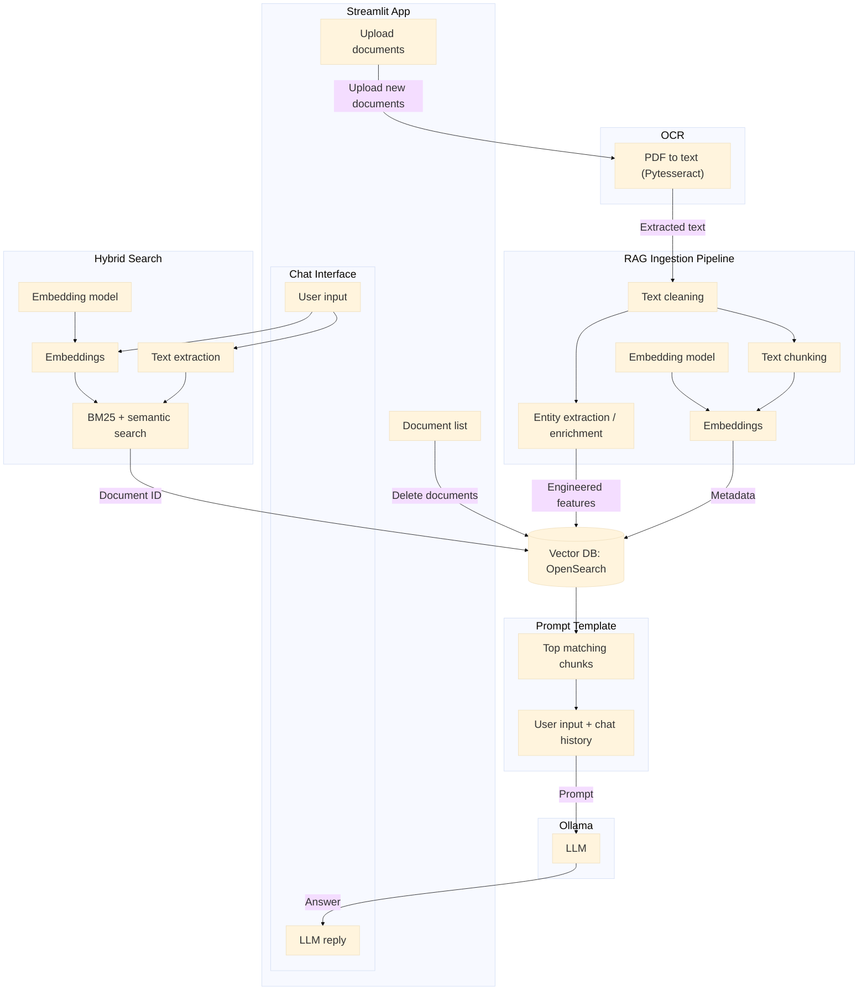

# Docly - Private Local AI Document Assistant

**Docly** is a local AI-powered document assistant that allows users to upload PDF files and interact with them through natural-language conversations. The system processes the documents, creates embeddings, retrieves relevant information, and uses a **local LLM with Retrieval-Augmented Generation (RAG)** to generate answers grounded in the uploaded documents.

---

## Why I Built This

Most document Q&A tools (ChatPDF, Notion AI, etc.) send your data to external APIs. I wanted:
- **Full privacy** - Documents never leave your machine
- **Zero cost** - Run local LLMs via Ollama, no API keys needed
- **Customizable** - Swap embedding models, LLMs, chunking strategies
- **Learning** - Understand RAG pipeline internals end-to-end

---

## Architecture Overview


---

## Data Flow

| Step | Component | What Happens |
|------|-----------|--------------|
| **1** | User uploads PDF | `PyPDF2` extracts text → cleaned → chunked (300 words, 100 overlap) |
| **2** | Embedding | `sentence-transformers/all-mpnet-base-v2` → 768-dim vectors |
| **3** | Indexing | Chunks + embeddings + metadata → OpenSearch (knn_vector + text) |
| **4** | User asks question | Query embedded → hybrid search (BM25 + kNN) in OpenSearch |
| **5** | Context retrieval | Top-k chunks returned as context |
| **6** | Prompt building | System prompt + context + chat history + user query |
| **7** | Generation | Ollama streams response token-by-token |
| **8** | Display | Response shown in chat with streaming cursor |

---

## Tech Stack

| Layer | Technology |
|-------|------------|
| **Frontend** | Streamlit (multipage, native navigation) |
| **Vector DB** | OpenSearch (hybrid search: BM25 + kNN) |
| **Embeddings** | sentence-transformers (all-mpnet-base-v2, 768-dim) |
| **LLM** | Ollama (qwen2.5:3b / llama3.2:3b - runs locally) |
| **PDF Parsing** | PyPDF2 + OCR fallback (pytesseract) |
| **Orchestration** | Python, async streaming |

---

## Quick Start

### Prerequisites
- Python 3.11+
- Docker Desktop
- Ollama installed locally

### 1. Start Services
```bash
# OpenSearch (vector DB + hybrid search)
docker run -d --name opensearch \
  -p 9200:9200 -p 9600:9600 \
  -e "discovery.type=single-node" \
  -e "plugins.security.disabled=true" \
  opensearchproject/opensearch:2.19.0

# Ollama (local LLM)
ollama serve
# In another terminal:
ollama pull qwen2.5:3b
```

### 2. Setup Project
```bash
git clone <your-repo>
cd Docly

# Create venv & install deps
python -m venv .venv
source .venv/bin/activate  # Windows: .venv\Scripts\activate
pip install -r requirements.txt
```

### 3. Run App
```bash
streamlit run app.py
```
Open http://localhost:8501

---

## Detailed Setup Guide

See [`enviroment_setup.md`](enviroment_setup.md) for step-by-step instructions covering:
- Python 3.11+ installation (macOS/Windows/Linux)
- `uv` fast package manager
- Docker Desktop setup
- Ollama installation & model pulling
- OpenSearch + Dashboards via Docker
- OCR engine (Tesseract + Poppler) for scanned PDFs
- Virtual environment & kernel registration for Jupyter

---

## Project Structure

```
Docly/
├── app.py                    # Entry point, page config, theme, sidebar
├── pages/
│   ├── chatbot.py           # Chat UI + RAG query handling
│   └── upload_document.py   # PDF upload, indexing, doc management
├── src/
│   ├── theme.py             # Shared CSS theme (CSS variables)
│   ├── constants.py         # Config: model names, dimensions, ports
│   ├── llm.py               # Prompt building, Ollama streaming
│   ├── embeddings.py        # SentenceTransformer wrapper
│   ├── ingestion.py         # Index creation, bulk indexing, deletion
│   ├── opensearch.py        # Client + hybrid search + pipeline
│   ├── utils.py             # Text cleaning, chunking, logging
│   └── index_config.json    # OpenSearch index mapping template
├── images/
│   └── docly_logo.png
├── requirements.txt
├── enviroment_setup.md
└── issues.md                # Known issues & fixes
```

---

## Key Features

| Feature | Implementation |
|---------|----------------|
| **Hybrid Search** | BM25 (keyword) + kNN (semantic) with normalization pipeline |
| **Streaming Responses** | Token-by-token via Ollama async generator |
| **Chat History** | Last 10 messages included in context window |
| **RAG Toggle** | Enable/disable document search per query |
| **Temperature Control** | 0.0 (deterministic) → 1.0 (creative) |
| **Document Management** | Upload, list, delete with real-time sync |
| **OCR Support** | pytesseract fallback for image-based PDFs |

---

## Configuration (`src/constants.py`)

```python
EMBEDDING_MODEL_PATH = "sentence-transformers/all-mpnet-base-v2"
EMBEDDING_DIMENSION = 768
TEXT_CHUNK_SIZE = 300
OLLAMA_MODEL_NAME = "qwen2.5:3b"     # Change to your model
OPENSEARCH_HOST = "localhost"
OPENSEARCH_PORT = 9200
OPENSEARCH_INDEX = "documents"
```

---

## Interview Talking Points

> **"I built a local RAG system from scratch. Here's how it works:"**

1. **Ingestion**: PDFs → text extraction → cleaning → chunking (300 words, 100 overlap) → embeddings (768-dim mpnet) → OpenSearch index with knn_vector + text fields

2. **Retrieval**: User query → embed → hybrid search in OpenSearch (BM25 + kNN combined via normalization pipeline with 0.3/0.7 weights) → top-k chunks

3. **Generation**: System prompt + retrieved context + chat history (last 10) + user query → Ollama local LLM (qwen2.5:3b) → streaming response

3. **Privacy**: Everything runs locally - OpenSearch in Docker, Ollama on host, no external API calls

4. **Extensibility**: Swap embedding model (change constant), LLM (pull different Ollama model), chunking strategy (modify utils.py), search weights (pipeline config)

---

## Known Issues & Fixes

See [`issues.md`](issues.md) - tracks 25 issues across Critical/High/Medium/Low priority with fixes applied.

**Major fixes completed:**
- OpenSearch hybrid search pipeline auto-creation + fallback
- Ollama model list parsing fix
- Asymmetric embedding prefix correction (query: vs passage:)
- Chat history duplication bug
- SSL config for OpenSearch Docker on Windows

---

## License

MIT - Feel free to use for learning or production.